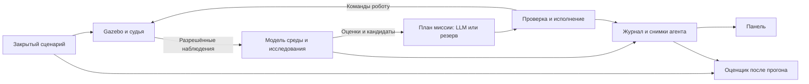

# Архитектура полного решения

Предлагаемый проект. Стек и уже работающий код сохраняются; изменения вводятся последовательно по [roadmap.md](roadmap.md). Словарь предметной области — [CONTEXT.md](../CONTEXT.md).

## 1. Три разных представления о мире

1. **Истина сценария:** скрытые образцы, зоны, их параметры и расписание изменений. Доступны только среде и оценщику после прогона.
2. **Наблюдения:** фактические ROS-сообщения, ответы collect/finish, разрешённые события. Единственный источник знаний агента, кроме публичной геометрической карты и правил миссии.
3. **Модель среды агента:** его оценки стоимости, перспективных областей, опасностей и надёжности датчика. Каждая оценка имеет происхождение, актуальность и неопределённость.

Одинаковые координаты у этих представлений не означают одинаковое содержимое. Получение оценки не раскрывает истинную границу зоны. Низкий сигнал не доказывает отсутствие образцов. Один штраф не доказывает размер опасной области.

## 2. Модули и их интерфейсы

Названия ниже описывают целевую ответственность; это не требование создать отдельный процесс или класс для каждой строки.

| Модуль | Небольшой интерфейс | Владеет | Не знает |
| --- | --- | --- | --- |
| Генератор сценариев | `generate(profile, seed, rules) -> ScenarioTruth` | Размещение, события, проверка решаемости, версия сценария | Решения агента |
| Среда и судья | Шаг по физической позе/времени, collect, finish; ROS `/did/*` | Батарея, собранные образцы, эффекты событий, фактический исход | Оценки и гипотезы агента |
| Исследование | `observe(observation) -> ModelUpdate`, `propose_experiment(budget)`, `evaluate(experiment_id)` | Модель среды, качество измерений, гипотезы, смены режима | Истина сценария, сеть, ROS, UI |
| Навигация | `plan(start, goal, model) -> RouteAssessment` | Планирование геометрического пути с оценкой затрат и ограничений | Скрытые цели и параметры судьи |
| Планирование миссии | `propose(MissionContext) -> MissionPlan` | Выбор последовательности подцелей и причин пересмотра | Управление скоростью, скрытая разметка |
| Исполнение миссии | Старт, остановка, обработка наблюдения/результата | Состояние прогона, активный план/действие, проверки ограничений, исходы операций | Реализация HTTP/LLM/ROS |
| Управление движением | Следовать маршруту, остановить, сообщить прогресс/застревание | Команды скорости и локальное исполнение | Текст миссии, секреты API |
| Хранилище свидетельств | Добавить запись, получить последовательность, экспортировать прогон | Упорядоченные записи и воспроизводимые артефакты | Выбор следующей цели |
| Панель | Снимки/журнал через HTTP, команды start/stop | Представление и взаимодействие пользователя | Скрытая истина и управление ROS |

Внутренние вычисления исследований — обычные функции и классы. Порты нужны для реально разных реализаций: ROS/тестовый робот, LLM/алгоритмический планировщик, файловый/тестовый журнал. Не вводим универсальную шину событий, микросервисы, БД или интерфейс на каждый класс без текущей необходимости.

## 3. Слои и постепенное изменение кода

Направление зависимостей: `adapters → application → domain`. Симулятор и судья имеют собственное ядро, без импорта `backend` и его оценок. Frontend сохраняет `adapters/ui → application → domain`.

- В `domain` остаются гипотезы, оценки, маршруты, ограничения и переходы состояний. Предметные вычисления не выполняют I/O.
- В `application` остаются последовательность действий, порты и обработка результатов. Один исполнитель владеет изменяемым состоянием прогона; внешние callback не меняют модель исследования напрямую.
- `MissionController` сначала покрывается проверками поведения. Из него последовательно выделяется координация эксперимента, затем исполнение плана. Перенос файлов без уменьшения ответственности не считается улучшением.
- Краткие блокировки и потоки принадлежат координации; неизменяемый снимок доступен HTTP. Перенос текущей блокировки из `Mission` оправдан только вместе с установлением единого владельца состояния, не как отдельная косметическая переделка.
- Точка запуска собирает адаптеры. Карта передаётся backend отдельно; весь каталог `simulation` ему не монтируется. Генератор, закрытые настройки и truth-артефакты не входят в образ и доступные директории агента.

## 4. Среда: профили, события и физические эффекты

Профили easy/medium/hard имеют соответственно 3/5/7 образцов и 1/3/4 грунтовые зоны. Случайность разделяется на потоки размещения, шума и событий, чтобы изменения одного алгоритма не переставляли весь сценарий. Сохраняются seed, версия генератора, параметры и хеш публичной карты.

Генератор проверяет достижимость с учётом размера робота, размещение базы, отсутствие наложения образцов и разумный энергетический бюджет. Для приёмочных сценариев сохраняется физически доступный путь возврата; hard не должен случайно превращаться в гарантированное поражение. Исчерпывающий сбор всех образцов не требуется объявлять возможным в каждом сценарии. Отдельные заведомо неразрешимые случаи нужны только для испытания честного завершения с ошибкой.

События hard: смена параметров грунта, появление опасности и неисправность sample-датчика. Они привязаны к времени симуляции или условиям физического мира, не к внутреннему состоянию алгоритма. Агент не получает расписание, тип скрытого изменения или дополнительный уведомляющий топик. `/did/events` передаёт только разрешённые события взаимодействия; закрытый журнал фиксирует момент вмешательства для последующего сравнения.

**Грунт:** отдельный технический эксперимент сравнивает варианты реализации замедления при сохранении геометрии и модели робота. Предпочтение — эффект на стороне Gazebo. Изменение трения само по себе не принимается за доказательство замедления: измеряем скорость/время проезда и расход на равных отрезках. Масштабирование команд средой, если понадобится как временная модель, явно маркируется и не выдаётся за изменение физики контакта. Выбранную трактовку сверяем с организаторами.

**Опасность:** для первой полной реализации задаём ограниченный штраф/временный эффект, который оставляет возможность адаптации. Перманентную поломку не используем как основное доказательство умения продолжать миссию. Сценарии и варианты отказов документируются как локальные правила.

**Коллизии:** лидар используется для предотвращения удара, но его расстояние не считается контактом. Локальный judge регистрирует штраф по Gazebo `Contacts`, когда collider робота соприкасается с объектом, отфильтровывая контакт с ground plane. Live probe физического столкновения подтверждён; правила локального judge остаются проектным допущением до сверки с организаторами.

## 5. Научный цикл без выдуманных выводов

1. Из синхронизированных наблюдений выделяется отрезок пути. Учитываются повороты, штрафы, пропуски, границы пространственных ячеек и время; сомнительные данные не считаются чистой стоимостью грунта.
2. Агент формулирует гипотезу и **до действия** сохраняет измеримый прогноз, альтернативное объяснение, критерий проверки и допустимый бюджет.
3. Планируется безопасный проверочный маршрут с достаточной длиной измерения и обеспеченным возвратом. Точка прибытия внутри области ещё не означает, что выполнен подходящий эксперимент.
4. Новые наблюдения связываются с действием. Измерения, породившие гипотезу, не используются повторно как независимое подтверждение.
5. Вывод: подтверждается измерениями / опровергается / недостаточно данных / отложено. «Подтверждается» относится к условиям и объёму проверки, не к универсальному физическому закону.
6. Оценка и её неопределённость обновляются; журнал связывает изменение с последующим маршрутом, выбором цели или запасом возврата.

Примеры: «расход в области выше базового», «раньше дорогая область стала дешевле», «разброс сигнала вырос при повторных измерениях из сопоставимых поз». Датчик ближайшего образца может менять сигнал из-за движения, сбора и смены ближайшего объекта: эти случаи проверяются до объявления поломки.

## 6. Адаптация как пересмотр модели

| Наблюдаемое расхождение | Проверка альтернатив | Реакция |
| --- | --- | --- |
| Расход выше или ниже прогноза | Поворот, штраф, движение через несколько областей, недостаточная дистанция | Уменьшить доверие к старой оценке, открыть новый режим, пересчитать маршрут и возврат |
| `hazard_hit` в разрешённом событии | Сопоставить время и позу; учесть неточность положения | Отметить наблюдаемую рискованную область с неопределённостью; обойти и перепланировать |
| Шум, залипание или исчезновение sample-сигнала | Движение, сбор, естественно слабый сигнал, достаточное окно наблюдений | Перейти к осторожному поиску/повторным пробам; ограничить сборы вслепую; вернуться при недостатке данных или энергии |

Начинаем с небольших окон и устойчивых статистик, выбранных по контрольным данным. Более сложный алгоритм обнаружения изменений нужен только если простые методы не проходят испытания. Пороги настраиваются на тренировочных сценариях, затем фиксируются перед контрольной серией.

Старая история сохраняется для журнала, но новая оценка не усредняется без ограничений со всей историей до изменения. Для `unknown`, `suspected`, `confirmed`, `recovering` задаются явные условия переходов и защита от постоянного переключения. После адаптации нужна проверка восстановления на новых измерениях.

## 7. План LLM и алгоритмические ограничения

`MissionContext` включает текст миссии, текущую позу, энергию, модель среды, достижимые кандидаты, качество датчиков, действующие гипотезы и краткие свидетельства. Не включает истинные координаты образцов, параметры зон, расписание событий или seed для восстановления сценария.

`MissionPlan` содержит `plan_id`, `run_id`, версию модели, конечный список подцелей, условия их выполнения/пересмотра и краткое обоснование со ссылками на свидетельства. Предлагаемый горизонт — 2–4 шага; точный предел является настройкой. Терминальный возврат может быть единственным шагом. Виды действий ТЗ сохраняются; эксперимент связывается с подцелями движения через `experiment_id`.

Перед каждым шагом исполнитель заново проверяет достижимость, актуальность условий, ограничения попыток сбора и бюджет **действие + возврат + неопределённость + резерв**. `collect` также требует допустимого контекста: наличие сигнала само по себе не разрешает бесконечные попытки. Неизвестный результат запроса collect/finish после таймаута требует сверки с доступным состоянием судьи; слепой повтор не считается идемпотентным.

LLM может выбрать из подготовленных кандидатов и предложить проверку гипотезы, но не объявить её подтверждённой и не командовать скоростью. Ошибка, таймаут, невалидные координаты, цикл одинаковых целей или устаревший ответ ведут к проверяемому резервному плану. Ответы привязаны к прогону и версии модели, поэтому ответ до reset или изменения обстановки не применяется автоматически.

Цель — больше подтверждённых сборов при допустимом возврате. Сравниваем кандидатов по ожидаемой пользе поиска, энергии, риску и полезности измерения; веса калибруем на данных. «Собрано три» не универсальный повод завершить medium/hard. Глобальный оптимум при скрытых образцах не обещаем; качество показываем сравнением с зафиксированной базовой политикой на одинаковых сценариях.

## 8. Время, остановка и жизненный цикл

- Время симуляции используется для физических экспериментов и событий; монотонное время процесса — для таймаутов и контроля свежести. При reset меняется идентификатор поколения прогона, старые наблюдения/запросы отбрасываются.
- Приоритеты исполнения: остановка/критический отказ → безопасность движения → запас возврата → текущая подцель → новое планирование. LLM, файловый журнал и HTTP не блокируют контур остановки.
- Сбой sample-датчика отделён от потери позы, батареи или критических данных для движения. При первом возможно ограниченное продолжение; при втором движение прекращается.
- На физическом входе робота один владелец итоговых команд. Сторож команд останавливает робота и при падении процесса агента; teleop используется отдельным явным режимом без одновременного управления.
- Перепланирование прекращает прежнее исполнение. Stop, reset и завершение освобождают запросы/потоки; восстановление связи само не возобновляет старое движение.
- `completed` требует подтверждённого finish. Stop — прерывание; отказ возврата или судьи — отдельный исход. Потеря журнала видна как ошибка сохранения, а не скрытый успех научной приёмки.

## 9. Панель и свидетельства

Показываем положение, путь, запас возврата, выполненные сборы, текущий план, оценки среды, качество датчика, гипотезу и связанный эксперимент. При перепланировании видна причина и сравнение ожидания с наблюдением. Оценки агента обозначены как оценки.

Истина сценария доступна только отдельному разбору после завершения прогона, без обратного канала в агент. Журнал содержит идентификаторы прогона, плана, эксперимента, версию модели, время и ссылки на исходные измерения. Объяснение LLM отделено от численного вывода алгоритма. Экспорт содержит весь журнал, а не только отображаемый хвост.

Расширения HTTP согласуются до параллельной разработки. Совместимые поля добавляются к v1 с fixtures и проверками обеих сторон; несовместимое изменение вводится новой версией без молчаливого нарушения контракта MVP.

## 10. SLAM: самостоятельная карта с корректными координатами

По решению пользователя SLAM входит в целевой объём. Сначала отдельный профиль одного робота со SLAM Toolbox, затем совместная работа двух роботов. Стандартный профиль с готовой картой сохраняется как контроль и как самостоятельное покрытие исходного задания.

- Модуль навигации получает версионированную геометрическую карту через существующий seam источника карты. Для SLAM карта обновляется; изменение препятствий/свободного пространства инвалидирует зависимые маршруты.
- SLAM-профиль не загружает готовую occupancy-карту в агент. Режим оценивает свободные области, неизвестное пространство и границы разведки; неизвестная клетка не становится автоматически проходимой.
- Начало и ориентация карты согласуются с мировой системой через известную стартовую позу и проверенное преобразование. Смещение старта нельзя одновременно прибавлять к odom и повторно в TF. Проверяем `map → odom → base` на старте, после движения и после коррекции карты.
- При замыкании петли сохранённые измерения грунта и поисковые наблюдения должны остаться согласованными с исправленной позой. Сохраняем исходные позы/время/систему координат и определяем преобразование или повторную проекцию; нельзя просто оставить старые оценки на прежних клетках.
- Судья использует физическую позу из симулятора, независимую от SLAM. Ground truth доступен оценщику для измерения ошибки, но не локализации или планированию агента.
- Проверяем поиск, возврат и эксперимент на самостоятельно построенной карте, а не только наличие картинки SLAM. План возвращения учитывает уже исследованный проход и неопределённость локализации.

Технический этап должен проверить возможности установленного SLAM Toolbox и выбрать поддерживаемый способ начальной привязки/коррекции. Конкретные параметры и launch-аргументы фиксируются после проверки, не угадываются в плане.

## 11. Два робота: совместная миссия, локальная безопасность

Это отдельное расширение стандартного мира в рамках бонусного трека. Меняем число экземпляров стандартного Burger, сохраняя контрольный режим одного робота. Второй старт и правила командного результата — локальные допущения до согласования с организаторами.

- Каждый робот имеет `robot_id`, свою позу, батарею, состояние исполнения, сторож команд и пространство имён ROS/TF. Запас возврата рассчитывается индивидуально.
- Один координатор назначает области/подцели на основе публичной карты и общей модели наблюдений; исполнители самостоятельно проверяют безопасность. Начальная политика распределяет кандидатов по приросту полезности с учётом энергии, риска и дублирования исследования.
- Общая модель принимает измерения с `robot_id`, временем, источником и идентификатором. Повторная доставка одного наблюдения не увеличивает уверенность. Противоречивые измерения не усредняются как равно надёжные без проверки систем координат и условий.
- Бронирование цели ограничено по времени. Потеря робота освобождает задания после таймаута; оставшийся продолжает, если позволяют его наблюдения и энергия. Он не получает скрытые координаты образцов потерянного робота.
- Два робота не получают награду за один образец: сбор атомарно подтверждает общий судья. Удаление уже собранного ближайшего образца меняет сигнал обоим; этот эффект учитывается при обнаружении неисправностей.
- Локальное предотвращение столкновений учитывает другого робота, а для узких проходов действуют приоритет/уступание и ограниченный по времени резерв прохода. Нужны проверки встречного разъезда, взаимной блокировки и устаревшего положения соседа.
- Миссия команды завершается после согласованных исходов обоих роботов. Общий успех и частичный результат различаются; возврат одного не маскирует потерю второго.

Однороботный `/did/*` контракт ТЗ сохраняется в контрольном профиле. Для двух роботов отдельно документируем ROS-пространства имён и агрегированный счёт, не называя это официальным расширением. Панель получает коллекцию состояний роботов и командный план через версионированный HTTP-контракт.

Совместный SLAM-профиль сначала проверяет локализацию обоих роботов в единой мировой системе. Предпочитаем простой подтверждённый вариант общей карты и индивидуальной локализации; распределённое слияние карт вводим только если оно нужно для выбранной реализации. Карта в любом случае строится из наблюдений, а не подгружается из эталона.

## 12. Воспроизводимая инфраструктура знаний

Экспорт прогона объединяет исходные измерения, версии кода/правил, гипотезы, численные выводы, решения и результат судьи. По нему можно воспроизвести анализ, найти ошибочную гипотезу и сравнить стратегии. Применение для образования: объяснить, как измерение меняет модель; для науки: проверять стратегию исследования при ограниченном ресурсе.

В репозитории создаются узкие практические скиллы для проверки ROS/Gazebo, проведения эксперимента и подготовки отчёта. Их результат оценивается повторяемостью команд и проверок. Сохраняются реальные журналы разработки и примеры исправлений; секреты и личные данные исключаются. Наличие файлов скиллов без свидетельств использования не закрывает этот пункт.
