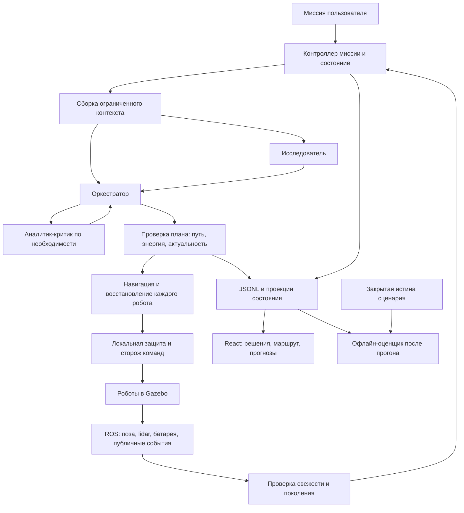

# Роли, полномочия и поток данных

## Сколько агентов

Предлагаем три логические роли с LLM на всю миссию команды. Это могут быть три конфигурации одного провайдера в одном backend-процессе; отдельные контейнеры и разные модели не обязательны. Два физических робота не удваивают число LLM-ролей. Их локальные исполнители и батареи независимы.

| Роль | Получает | Возвращает | Когда вызывается |
| --- | --- | --- | --- |
| Оркестратор | Цель пользователя, текущий снимок команды, допустимые кандидаты, ответы специалистов | Короткий MissionPlan, назначения robot_id, ссылки на основания, условия пересмотра | Старт, завершение подцели, существенное изменение, отказ |
| Исследователь | Активные гипотезы, расхождения прогнозов, допустимые измерения, бюджет эксперимента | Предложение эксперимента: прогноз, различаемые альтернативы, действие, критерий завершения | Новая аномалия либо возможность полезного эксперимента |
| Аналитик-критик | Предложенный план/эксперимент и ограниченная выборка свидетельств | Структурированные замечания: противоречия, недостаток данных, confounders, рекомендуемая проверка | Рискованный/новый эксперимент, существенное противоречие, завершение этапа |

Оркестратор отвечает за приоритеты и выбор следующего плана. Единый владелец изменяемого состояния — application-контроллер, а не диалог LLM. Исследователь не выставляет итоговый научный вердикт единолично: численный вывод рассчитывается ядром по измерениям. Критик не отменяет защиту и не подтверждает finish. Голосование нескольких LLM не заменяет доказательства.

## Сквозной поток

Нет ребра от закрытой истины к агентам. Онлайн-метрики считаются из наблюдений, а не через чтение UI или переигрывание rosbag на каждом тике.

## Контракт обсуждения

Каждый запрос/ответ несёт `request_id`, `run_id`, `generation`, `robot_ids`, `state_revision`, `map_revision`, `model_revision`, deadline и `evidence_ids`. Предложение содержит конечный список действий, expected_effect, invalidation_conditions и reason_code. Это проект расширения текущих типов, не объявление готового API.

Перед применением проверяются схема, совпадение поколения, изменившиеся предпосылки, допустимые robot_id, достижимость, бюджет и права роли. Повтор request_id не исполняет действие повторно. Смена карты/модели требует повторной алгоритмической проверки зависимого плана, а не обязательно нового LLM-запроса.

Один цикл: снимок → параллельная подготовка независимых предложений → один разбор критиком при необходимости → не более одной корректировки → проверка → исполнение. Начальный лимит: до 4 вызовов LLM на цикл, один незавершённый запрос на роль, общий deadline и денежный лимит на прогон. Числа подбираются по измеренным задержкам. Бесконечные переговоры запрещены.

Если специалист недоступен, используем проверяемую алгоритмическую политику. Если оркестратор недоступен, ResilientPlanner выбирает fallback. Текущий безопасный шаг может продолжаться только пока действуют его предпосылки. При отсутствии безопасного действия — остановка. Пользовательский Stop и критический отказ сразу инвалидируют запросы; завершившийся позднее ответ не возобновляет движение.

## Навигация — алгоритмический модуль

Расширять текущие PathTracker, NavigationService, MotionExecutor, TerrainEstimator и HazardMap; не строить второй независимый стек рядом.

- Проверка занятого корпусом коридора, текущей скорости, задержки и тормозного пути. Отдельно мгновенная остановка и фильтрация для перепланирования.
- Временный слой препятствий: координатная система, источник, время наблюдения, срок актуальности, уверенность. Истечение TTL не доказывает свободный проход: нужна свежая проверка lidar.
- Отклонение от ближайшего допустимого сегмента оставшегося маршрута; последовательный индекс, гистерезис, длительность отклонения и cooldown. Опасность обходит cooldown.
- Бюджет цели: путь туда + действие + путь домой + неопределённость + восстановление. Отсутствие пути/оценки не означает нулевой расход. Режим возврата фиксируется до завершения или явного сброса миссии.
- Застревание — отсутствие продвижения вдоль пути при выданной команде; ожидание, уступание и плановый поворот учитываются отдельно. Нынешняя проверка расстояния до конечной цели может ошибаться на обходе препятствия.
- Восстановление ограничено попытками, временем и энергией; отход и поворот проверяют пространство корпуса по свежим данным. Неизвестная зона сзади не считается свободной.

## Чистая архитектура и владение

| Слой | Ответственность |
| --- | --- |
| domain | Геометрия коридора, прогресс пути, модели энергии/риска, типы свидетельств и решений, правила бюджетов |
| application | Жизненный цикл, диспетчеризация ролей, сборка контекста, проверка предложений, отмена, координация роботов |
| adapters | LLM-запросы, ROS, хранилище, журнал, HTTP; преобразование транспортных данных в типы ядра |
| frontend | Отображение read-model, устаревших данных и причин; не расчёт независимого решения о безопасности |
| scripts/analysis | Независимый анализ артефактов и скрытой истины после прогона |

Сначала использовать существующие seams Planner, MapSource, Journal и порты движения/судьи. Оркестрацию подключить за интерфейсом Planner, сохранив FallbackPlanner; добавить ограниченную память внутри application. Новый универсальный фреймворк агентов и отдельный брокер сообщений пока не нужны.
